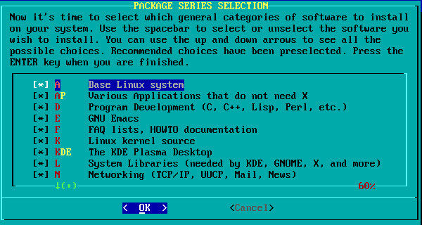
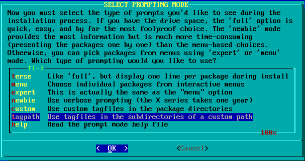
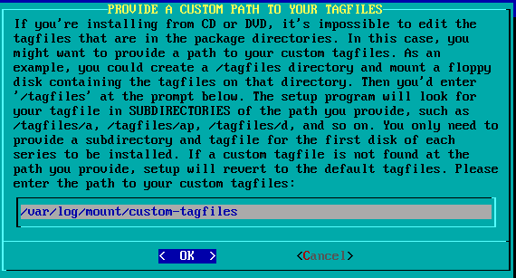

# Slackware-tagfiles Project

Custom Slackware tagfiles for building a smaller "jump" VM.

The `jump/` profile is intended for DevOps/jumpbox usage: SSH, shell tools,
Python, Git, curl/wget, Kubernetes tools, and general troubleshooting.

Package list: [`jump/package_list.txt`](jump/package_list.txt)

> Note: `/home/r1w1s1` is only an example path from my machine. Replace it with your own home directory.

## Building a Custom ISO

Download AlienBOB's Slackware mirror script:

```sh
wget http://www.slackware.com/~alien/tools/mirror-slackware-current.sh -O /usr/local/bin/mirror-slackware-current.sh
chmod +x /usr/local/bin/mirror-slackware-current.sh
```

Mirror the Slackware tree:

```sh
RELEASE="current" SLACKROOTDIR="/home/r1w1s1/slackware-mirrors/slackware" ISO="NONE" sudo mirror-slackware-current.sh -f
```

Copy the custom tagfiles into the Slackware tree:

```sh
sudo mkdir /home/r1w1s1/slackware-mirrors/slackware/slackware64-current/custom-tagfiles
cd jump
sudo cp -a * /home/r1w1s1/slackware-mirrors/slackware/slackware64-current/custom-tagfiles
```

Generate the ISO:

```sh
RELEASE="current" SLACKROOTDIR="/home/r1w1s1/slackware-mirrors/slackware" ISOONLY="yes" mirror-slackware-current.sh
```

## Installation

At **PACKAGE SERIES SELECTION**, press Enter.



At **SELECT PROMPTING MODE**, choose **tagpath**.



Enter the custom tagfiles path:

```text
/var/log/mount/custom-tagfiles
```



For network configuration, choose **DHCP** (default).

NetworkManager may appear in the installer, but it is not used by this profile.

## Chroot Testing

The `jump/chroot-jump.sh` script can test the same package set inside a local chroot.

```sh
cd jump
sudo ./chroot-jump.sh create
sudo ./chroot-jump.sh access
sudo ./chroot-jump.sh delete
```

By default, it uses:

```text
/home/r1w1s1/slackware64
```

Replace this with your own local Slackware mirror path.

## More Info

- https://www.slackbook.org/html/package-management-making-tags-and-tagfiles.html
- https://www.slackwiki.com/Tagfile_Install

## Mirror Site

https://codeberg.org/r1w1s1/slackware-tagfiles
